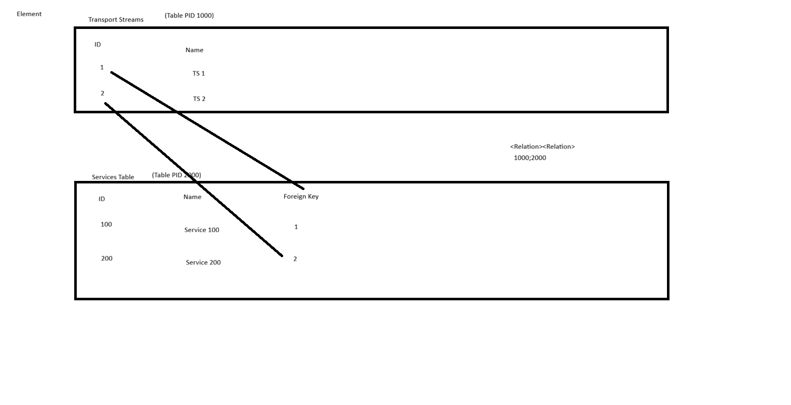

# Training Exercise QActions & Tables

## Description

The goal of this exercise is to parse a JSON file and fill in the data in the corresponding tables.
The JSON file contains an overview of transportstreams and services, the file is available in the Documentation folder.

* Create a Transportstreams table.
* Create a Services table.
* The columns needed are the properties defined in the JSON file.
* Add an extra column which reflects the last time the row was polled (DateTime).
* The data should be polled every minute.
* A button should be available to force poll the data.

## Pointers

Handle this exercise as would be for a customer.

* All parameter names/descriptions should be carefully chosen to really reflect the value.
* No errors/major/minor/... should be reported by the DIS validator.
* No magic numbers in QActions.
* Some rules when working with tables:
  * Every column name should start with the table name.
  * Every column description has the table description between round brackets.

## Tips

* You can either hardcode the JSON in your QAction or read the file from your file system.
* To parse the JSON use NewtonSoft.Json.
* Consider using the QActionTableRows for updating tables.

